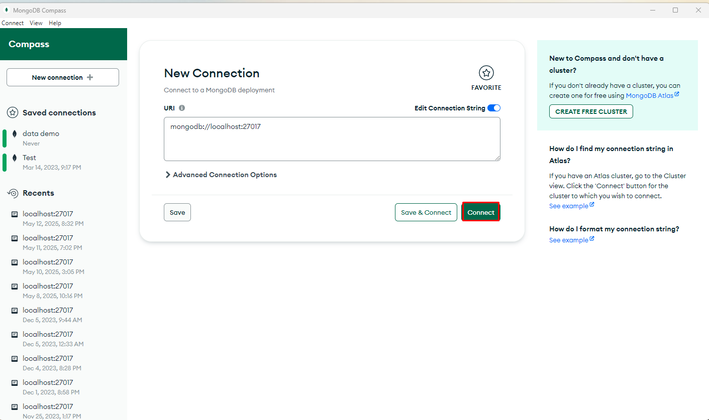
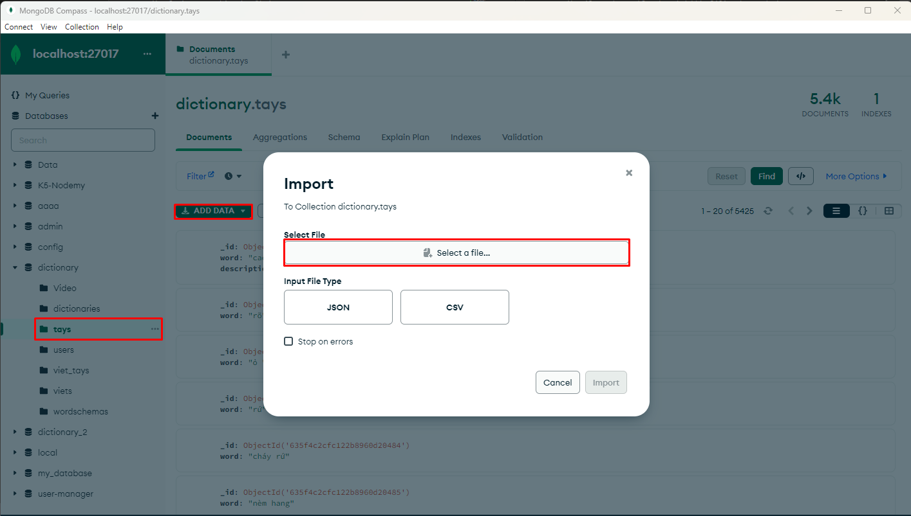

## 🛠️ Cài đặt cơ sở dữ liệu (MongoDB)

1. **Tải MongoDB Compass** tại: [https://www.mongodb.com/products/tools/compass](https://www.mongodb.com/products/tools/compass)

2. **Mở ứng dụng MongoDB Compass**

3. **Nhấn nút _Connect_** để kết nối  

   

4. **Nhập và import từng tệp dữ liệu cần thiết**  

   

5. **Sau khi import xong**, quay lại terminal (cd sever hoặc cd client) và chạy ứng dụng bằng lệnh:

   ```bash
   npm run start